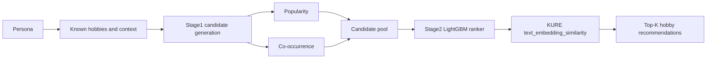

# GNN_Neural_Network: 취미 추천 시스템

이 폴더는 `Nemotron-Personas-Korea` 데이터에서 `Person -> Hobby` 취미 추천을 실험하는 오프라인 추천 시스템 workspace입니다.

## 현재 SOTA

현재 로컬 데이터와 현재 split 기준 SOTA는 다음 구성입니다.

```text
Stage1 = popularity + cooccurrence
Stage2 = LightGBM learned ranker
Stage2 feature = KURE-v1 text_embedding_similarity enabled
LightGBM num_leaves = 31
MMR = false
KURE Stage1 semantic provider = false
```

선택된 모델:

```text
GNN_Neural_Network/artifacts/experiments/phase5_c_text_embedding/current_locked_kure_stage2_num_leaves31_cpu10/ranker_model.txt
```

핵심 결론:

- KURE-v1은 **Stage2 feature**로 사용할 때 현재 split에서 성능이 좋아졌습니다.
- KURE-v1을 **Stage1 semantic candidate provider**로 쓰는 방식은 거절합니다. 후보 recall이 떨어져서 Stage2가 맞출 수 있는 정답 후보가 줄어듭니다.
- 따라서 현재 default 후보는 `popularity + cooccurrence -> LightGBM(num_leaves=31) + KURE text_embedding_similarity`입니다.

## 최신 동일 데이터 비교

최신 promotion-grade 비교는 현재 데이터, 현재 split, 같은 Stage1 후보풀, 같은 LightGBM recipe(`num_leaves=31`)를 고정했습니다. 바뀐 것은 Stage2에 KURE feature를 넣었는지 여부뿐입니다.

| Split | Model | Recall@10 | NDCG@10 | Candidate Recall@50 | Decision |
| --- | --- | ---: | ---: | ---: | --- |
| validation | no-text LightGBM | 0.591876 | 0.366105 | 0.827669 | baseline |
| validation | LightGBM + KURE Stage2 | 0.634706 | 0.396559 | 0.827669 | selected |
| test | no-text LightGBM | 0.579626 | 0.360270 | 0.827208 | baseline |
| test | LightGBM + KURE Stage2 | 0.617482 | 0.386258 | 0.827208 | current SOTA |

KURE Stage2 개선폭:

| Split | Recall@10 delta | NDCG@10 delta |
| --- | ---: | ---: |
| validation | +0.042830 | +0.030454 |
| test | +0.037856 | +0.025988 |

결론:

```text
현재 데이터/현재 split/동일 후보풀 기준에서는 KURE-v1 Stage2 feature가 no-text LightGBM보다 좋다.
KURE Stage2 text_embedding_similarity를 현재 오프라인 추천기의 SOTA/default 후보로 승격한다.
```

주요 비교 artifact:

```text
GNN_Neural_Network/artifacts/experiments/phase5_c_text_embedding/current_locked_num_leaves31_comparison.json
```

## 추천 구조



Stage1은 후보를 만드는 단계입니다. Stage2는 고정된 후보풀 안에서 순서를 다시 정렬하는 단계입니다. KURE는 현재 Stage2 feature로만 사용합니다.

## 실험 의사결정

| 실험 계열 | 역할 | 결과 | 현재 결정 |
| --- | --- | --- | --- |
| `popularity + cooccurrence` | Stage1 후보 생성 | 현재 후보풀에서 가장 안정적 | 유지 |
| LightGBM no-text | Stage2 baseline | 강한 baseline이지만 KURE Stage2보다 낮음 | 현재 split에서는 대체됨 |
| KURE text feature | Stage2 보조 feature | candidate recall 유지 상태에서 Recall/NDCG 개선 | 현재 split SOTA로 승격 |
| KURE semantic Stage1 | Stage1 후보 생성 | candidate_recall@50 하락 | 거절 |
| KURE dense MMR | diversity reranker | accuracy gate 실패 | 거절 |
| source one-hot features | Stage2 feature | 성능 하락 | 거절 |

## 다음 실험

다음 실험은 Stage1을 고정하고 Stage2 embedding feature만 개선하는 방향입니다.

1. 같은 `text_embedding_similarity` feature slot에서 다른 embedding backbone을 교체 비교합니다.
   - 1순위: `dragonkue/snowflake-arctic-embed-l-v2.0-ko`
   - 2순위: `dragonkue/multilingual-e5-small-ko-v2`
2. 현재 단일 KURE cosine feature를 domain별 feature로 분해합니다.
   - `kure_sports_similarity`
   - `kure_arts_similarity`
   - `kure_travel_similarity`
   - `kure_food_similarity`
   - 필요 시 `kure_family_similarity`, `kure_professional_similarity`
3. 고정 후보풀 내부에서 KURE rank/margin feature를 추가합니다.
   - `kure_similarity_percentile`
   - `kure_similarity_rank`
   - `kure_similarity_gap_to_top`
   - `kure_similarity_gap_to_mean`

모든 후속 실험 규칙:

- validation-first입니다.
- test split은 validation winner에 대해서만 1회 실행합니다.
- Stage1 후보풀은 `popularity + cooccurrence`로 고정합니다.
- candidate_recall@50이 떨어지면 승격하지 않습니다.
- 진행바는 항상 표시해야 합니다.
- 로컬 비교 run은 CPU thread count `10`을 사용합니다.
- cache/model metadata에는 embedding model, revision, preprocessing, masking, feature columns를 기록해야 합니다.

## 왜 이전 결과가 헷갈렸나

비교 기준이 두 개 섞여 있었기 때문입니다.

1. 예전 closed Phase 2.5 artifact
2. 현재 로컬 50K 데이터와 현재 split artifact

예전 closed Phase 2.5 feature cache는 validation person 수가 `9,841`명이고, 현재 validation split은 `10,857`명입니다. split/cache provenance가 다르기 때문에 예전 absolute metric과 현재 locked comparison을 직접 섞으면 안 됩니다.

현재 default 판단은 아래 조건의 비교만 사용합니다.

```text
same current split
same current candidate pool
same LightGBM recipe
no-text vs KURE Stage2 feature
```

이 통제 비교에서는 KURE Stage2가 이겼습니다.

## 현재 데이터 상태

현재 로컬 입력 파일:

```text
GNN_Neural_Network/data/person_hobby_edges.csv
GNN_Neural_Network/data/person_context.csv
```

현재 로컬 shape:

| 항목 | 값 |
| --- | ---: |
| edge rows | 50,000 |
| context rows | 50,000 |
| hobby edge가 있는 person | 17,907 |
| unique raw hobby strings | 49,558 |
| person당 평균 hobby 수 | 2.79 |
| person당 중앙값 hobby 수 | 3 |

raw hobby phrase는 안정적인 item ID가 아닙니다. promotion-grade 실험은 canonical/fallback item pipeline과 locked split artifact를 사용해야 합니다.

## 주요 Artifact

| 목적 | 경로 |
| --- | --- |
| 현재 SOTA 비교 | `artifacts/experiments/phase5_c_text_embedding/current_locked_num_leaves31_comparison.json` |
| 현재 SOTA 모델 | `artifacts/experiments/phase5_c_text_embedding/current_locked_kure_stage2_num_leaves31_cpu10/ranker_model.txt` |
| 현재 no-text baseline 모델 | `artifacts/experiments/phase5_c_text_embedding/current_locked_no_text_num_leaves31_cpu10/ranker_model.txt` |
| 실험 의사결정 | `artifacts/experiment_decisions.json` |
| 사람이 읽는 실험 요약 | `artifacts/experiment_run_summary.md` |

## 실행 명령

모든 명령은 repo root에서 `.venv` Python으로 실행합니다.

설치:

```powershell
.\.venv\Scripts\python.exe -m pip install -r GNN_Neural_Network\requirements-gnn.txt
```

현재 SOTA KURE Stage2 ranker 학습:

```powershell
.\.venv\Scripts\python.exe GNN_Neural_Network\scripts\train_ranker.py `
  --config GNN_Neural_Network\configs\kure_text_optin_ranker.yaml `
  --output-dir GNN_Neural_Network\artifacts\experiments\phase5_c_text_embedding\current_locked_kure_stage2_num_leaves31_cpu10 `
  --experiment-id current_locked_kure_stage2_num_leaves31_cpu10 `
  --include-text-embedding-feature `
  --num-leaves 31 `
  --cpu-thread-count 10 `
  --text-embedding-batch-size 32 `
  --progress-mode on
```

cached feature matrix에서 평가:

```powershell
.\.venv\Scripts\python.exe GNN_Neural_Network\scripts\evaluate_cached_ranker_matrix.py `
  --config GNN_Neural_Network\configs\kure_text_optin_ranker.yaml `
  --split test `
  --model-path GNN_Neural_Network\artifacts\experiments\phase5_c_text_embedding\current_locked_kure_stage2_num_leaves31_cpu10\ranker_model.txt `
  --feature-cache GNN_Neural_Network\artifacts\experiments\phase5_c_text_embedding\kure_text_feature_005_domain_tagged_full_validation\feature_cache\cache\features_14e3fdd1c821675f.npz `
  --output GNN_Neural_Network\artifacts\experiments\phase5_c_text_embedding\current_locked_kure_stage2_num_leaves31_cpu10\test_cached_metrics.json `
  --experiment-id current_locked_kure_stage2_num_leaves31_cpu10 `
  --cpu-thread-count 10 `
  --progress-mode on
```

## 문서

- `PRD.md`: 현재 요구사항, 모델 결정, promotion rule
- `TASKS.md`: 실행 가능한 작업 상태
- `DATASET_EXPLAIN.md`: 데이터 구조와 leakage 참고
- `artifacts/experiment_decisions.json`: machine-readable 실험 의사결정
- `artifacts/experiment_run_summary.md`: human-readable 실험 기록
