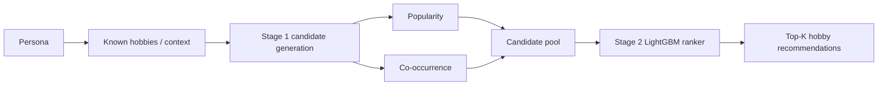
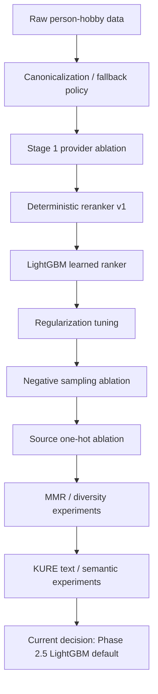
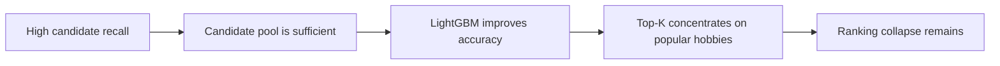

# GNN_Neural_Network: 취미 추천 실험 요약

이 폴더는 `Nemotron-Personas-Korea` 데이터에서 `Person -> Hobby` 추천을 실험한 오프라인 추천시스템 workspace입니다.

현재 결론은 명확합니다.

```text
현재 SOTA/default:
Stage 1 = popularity + cooccurrence 후보생성
Stage 2 = LightGBM learned ranker
Text feature = off
MMR = off
```

모델 artifact:

```text
GNN_Neural_Network/artifacts/experiments/phase2_5_num_leaves_31/ranker_model.txt
```

기준 문서:

- `PRD.md`: 실험 요구사항, 모델 정책, promotion gate
- `TASKS.md`: 현재 작업 상태
- `DATASET_EXPLAIN.md`: 데이터 형태와 학습 row 설명
- `artifacts/experiment_decisions.json`: machine-readable 실험 의사결정
- `artifacts/experiment_run_summary.md`: 최신 human-readable 실험 요약

## 추천 구조



Stage 1은 추천 후보를 넓게 뽑는 단계이고, Stage 2는 같은 후보 pool 안에서 순서를 다시 정렬하는 단계입니다.

## 현재 SOTA 성능

최종 SOTA는 closed Phase 2.5 LightGBM ranker입니다.

| Split | Model path | Recall@10 | NDCG@10 | Candidate Recall@50 | Decision |
| --- | --- | ---: | ---: | ---: | --- |
| validation | Stage 1 `popularity + cooccurrence` | 0.694035 | 0.435455 | 0.977645 | baseline |
| validation | Phase 2.5 LightGBM | 0.739051 | 0.457970 | 0.977645 | selected |
| test | LightGCN | 0.677980 | 0.429997 | - | analysis only |
| test | Stage 1 `popularity + cooccurrence` | 0.690885 | 0.437556 | 0.977136 | baseline |
| test | Phase 2.5 LightGBM | 0.709684 | 0.447713 | 0.977136 | current SOTA/default |

SOTA의 test 개선폭:

| Comparison | Recall@10 delta | NDCG@10 delta |
| --- | ---: | ---: |
| LightGBM vs Stage 1 baseline | +0.018799 | +0.010157 |

해석:

- 후보생성 자체는 이미 강합니다. `candidate_recall@50 ~= 0.977`입니다.
- 병목은 후보 retrieval 부족이 아니라 top-k 정렬에서 인기 취미로 몰리는 ranking collapse입니다.
- LightGBM은 정확도 기준 SOTA지만, 다양성 문제는 아직 남아 있습니다.

## 모델 실험 타임라인



| Order | Experiment | Tested | Result | Decision |
| ---: | --- | --- | --- | --- |
| 1 | Data preparation | raw hobby phrase canonicalization, rare item fallback | 50K local slice prepared, rare items kept with fallback | accepted with taxonomy warning |
| 2 | Stage 1 provider ablation | popularity, cooccurrence, LightGCN, BM25, PMI, IDF, Jaccard, pop-capped | `popularity + cooccurrence` was strongest stable candidate generator | accepted |
| 3 | Deterministic reranker v1 | persona-aware weighted reranker | strong diversity, lower accuracy than LightGBM | retained as fallback/comparison |
| 4 | LightGBM learned ranker | Stage 2 learned reranker | beat Stage 1 and v1 on validation/test Recall/NDCG | promoted |
| 5 | Regularization tuning | tree size and regularization | `num_leaves=31` selected | accepted |
| 6 | Negative sampling | `neg_ratio`, `hard_ratio` variants | `hard_ratio=1.0` won validation but lost final test | rejected default change |
| 7 | Source one-hot features | source flags for popularity/cooccurrence | validation Recall/NDCG/Coverage regressed | rejected |
| 8 | Category one-hot MMR | MMR lambda sweep | binary similarity made MMR ineffective | no-go |
| 9 | KURE dense MMR | KURE embedding MMR lambda 0.5/0.7/0.8/0.9 | all failed accuracy gate | no-go |
| 10 | KURE semantic Stage1 | `popularity + cooccurrence + kure_semantic` | candidate recall collapsed | rejected |
| 11 | KURE text feature | domain-tagged text embedding as Stage2 feature | useful signal vs matched weak control, below SOTA | not promoted |

## Stage 1 후보생성 실험

Stage 1은 `Person`에게 추천할 hobby 후보를 만드는 단계입니다.

현재 선택:

```text
popularity + cooccurrence
```

의미:

- `popularity`: train split에서 많이 등장한 취미를 후보로 사용
- `cooccurrence`: source persona가 가진 취미와 함께 자주 등장한 취미를 후보로 사용

핵심 결과:

| Provider / Combination | Validation Recall@10 | Validation NDCG@10 | Decision |
| --- | ---: | ---: | --- |
| `popularity + cooccurrence` | 0.694035 | 0.435455 | selected |
| LightGCN test reference | 0.677980 | 0.429997 | analysis only |
| BM25 ItemKNN | 0.4493 | 0.1970 | rejected |
| PMI ItemKNN | 0.0076 | 0.0030 | rejected |
| IDF / Jaccard / pop-capped variants | slightly below baseline | slightly below baseline | not selected |

결론:

- 현재 데이터에서는 graph neural candidate generator보다 단순하지만 강한 `popularity + cooccurrence`가 더 안정적입니다.
- LightGCN은 실험/분석용으로 남기지만 default Stage 1에 병합하지 않습니다.

## Stage 2 LightGBM 실험

현재 SOTA LightGBM 설정:

```text
num_leaves=31
min_data_in_leaf=50
learning_rate=0.05
reg_alpha=0.1
reg_lambda=0.1
neg_ratio=4
hard_ratio=0.8
include_source_features=false
include_text_embedding_feature=false
MMR=false
```

LightGBM이 학습하는 것은 `source_uuid`와 `hobby_id` 자체가 아니라 pair/candidate feature입니다.

주요 feature:

```text
popularity_prior
cooccurrence_score
known_hobby_count
candidate popularity / profile features
segment or context-derived numeric features
```

Feature importance는 `cooccurrence_score`와 `popularity_prior`에 크게 집중되었습니다. 따라서 정확도는 좋아졌지만 인기/동시발생 취미 쪽으로 top-k가 몰리는 ranking collapse가 남아 있습니다.

## KURE-v1 / text embedding 실험

KURE-v1 관련 실험은 세 계열로 나눠서 봐야 합니다.

| Experiment family | Role | Result | Default impact |
| --- | --- | --- | --- |
| KURE dense MMR | diversity rerank | all lambda failed accuracy gate | `MMR=false` 유지 |
| KURE semantic Stage1 | semantic candidate generator | candidate_recall@50 하락 | rejected |
| KURE text feature | Stage2 auxiliary feature | matched control 대비 signal 있음, SOTA 미달 | `include_text_embedding_feature=false` 유지 |

KURE semantic Stage1 결과:

| Run | Validation Recall@10 | Validation NDCG@10 | Candidate Recall@50 | Decision |
| --- | ---: | ---: | ---: | --- |
| closed Phase 2.5 baseline | 0.739051 | 0.457970 | 0.977645 | baseline |
| `kure_stage1_semantic_001_fast_gpu` | 0.599705 | 0.370891 | 0.794971 | rejected |

KURE domain-tagged text feature test 결과:

| Run | Split | Recall@10 | NDCG@10 | Candidate Recall@50 | Decision |
| --- | --- | ---: | ---: | ---: | --- |
| `phase2_5_num_leaves_31` | test | 0.709684 | 0.447713 | 0.977136 | current SOTA |
| `kure_text_feature_005_domain_tagged_20k_cpu10_test_matrix_retry` | test | 0.617482 | 0.386258 | 0.827208 | not promoted |

해석:

- KURE text feature는 같은 후보 pool 안에서는 positive signal을 보였습니다.
- 하지만 절대 성능이 closed Phase 2.5 SOTA보다 낮아서 default로 승격하지 않습니다.
- 앞으로 text embedding은 Stage2 보조 feature 후보로만 다룹니다. Stage1 semantic retrieval로 기본 전환하지 않습니다.

## Cold-start 결과

`known_hobbies <= 1`인 sparse user subset에 대한 별도 기준입니다.

| Split | People | V2 Recall@10 | V2 NDCG@10 | Candidate Recall@50 | Decision |
| --- | ---: | ---: | ---: | ---: | --- |
| validation | 8,563 | 0.592199 | 0.367798 | 0.827669 | fixed baseline |
| test | 8,563 | 0.589513 | 0.368271 | 0.827208 | fixed baseline |

Cold-start는 전체 promotion hard gate를 대체하지 않습니다. 다만 KURE/text/diversity 실험이 cold-start에서 개선되는지 반드시 별도 기록합니다.

## 현재 남은 문제



남은 핵심 문제:

- `candidate_recall@50`은 높으므로 retrieval 부족이 1차 병목이 아닙니다.
- LightGBM top-k가 인기/동시발생 취미에 강하게 몰립니다.
- coverage/novelty는 v1 deterministic reranker보다 낮습니다.
- taxonomy over-merge와 long-tail hobby phrase 문제가 diversity metric을 왜곡할 수 있습니다.

따라서 다음 개선 방향은 Stage1 교체보다 다음이 우선입니다.

1. accuracy-safe diversity reranking
2. LightGBM objective/feature balance 개선
3. taxonomy/canonicalization 품질 검수
4. leakage-safe text feature의 보조 feature 검증

## 실행 명령

모든 명령은 repo root에서 `.venv` Python으로 실행합니다.

Install:

```powershell
.\.venv\Scripts\python.exe -m pip install -r GNN_Neural_Network\requirements-gnn.txt
```

Prepare only:

```powershell
.\.venv\Scripts\python.exe GNN_Neural_Network\scripts\train_lightgcn.py --prepare-only
```

Stage 1 ablation:

```powershell
.\.venv\Scripts\python.exe GNN_Neural_Network\scripts\evaluate_stage1_ablation.py --split validation
```

Train current LightGBM ranker:

```powershell
.\.venv\Scripts\python.exe GNN_Neural_Network\scripts\train_ranker.py
```

Evaluate current LightGBM ranker:

```powershell
.\.venv\Scripts\python.exe GNN_Neural_Network\scripts\evaluate_ranker.py --split validation
.\.venv\Scripts\python.exe GNN_Neural_Network\scripts\evaluate_ranker.py --split test
```

Recommend for one persona:

```powershell
.\.venv\Scripts\python.exe GNN_Neural_Network\scripts\recommend_for_persona.py --uuid a5ad493e75e74e5cb4a81ac934a1db8f --top-k 10 --use-learned-ranker
```

## Artifact index

Core:

```text
GNN_Neural_Network/artifacts/experiment_decisions.json
GNN_Neural_Network/artifacts/experiment_run_summary.md
GNN_Neural_Network/artifacts/experiments/phase2_5_num_leaves_31/
```

Important experiment folders:

```text
artifacts/experiments/phase2_5_neg_ratio_*/
artifacts/experiments/phase2_5_source_onehot/
artifacts/experiments/phase2_5_cold_start_baseline/
artifacts/experiments/phase5_kure_mmr_lambda_*/
artifacts/experiments/phase5_d_stage1_kure_semantic/
artifacts/experiments/phase5_c_text_embedding/
artifacts/experiments/phase5_taxonomy_overmerge/
```

## Future experiment rules

- Compare against closed Phase 2.5 SOTA unless a newer default is explicitly recorded.
- Select on validation only.
- Run test only once for the validation-selected winner.
- Keep progress bars visible for long-running training/evaluation.
- Reuse caches only when data/config/split/model metadata matches.
- Record metrics, status, config, runtime, device, and cache policy under `artifacts/experiments/<run_id>/`.
- Do not promote KURE/text/MMR paths unless they beat the same accuracy and stability gates.
