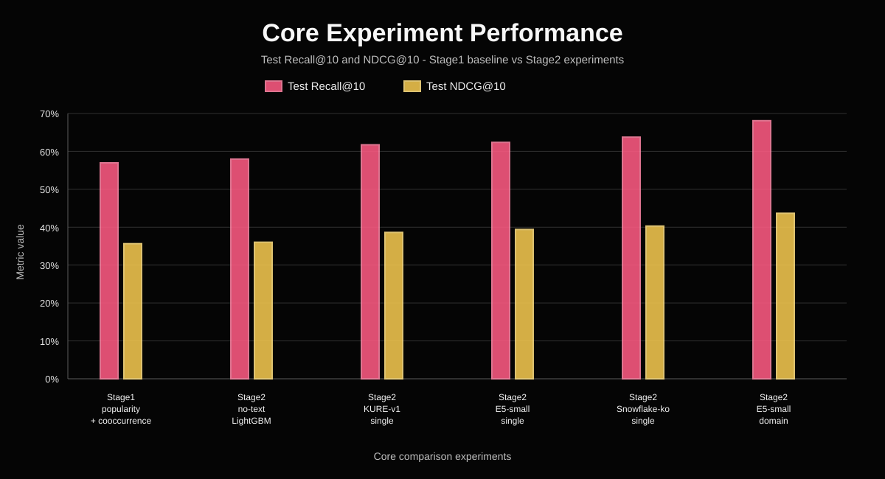

# GNN_Neural_Network: 취미 추천 실험 비교

이 폴더는 `Nemotron-Personas-Korea` 데이터에서 `Person -> Hobby` 추천 모델을
비교하는 오프라인 실험 workspace입니다. 현재 문서의 기준일은 2026-05-17입니다.

## 현재 결론

현재 split 기준 최종 선택 모델은 **E5-small-ko-v2 domain-specific Stage2**입니다.

```text
Stage1 = popularity + cooccurrence
Stage2 = LightGBM(num_leaves=31)
Embedding model = dragonkue/multilingual-e5-small-ko-v2
Feature policy = text_embedding_similarity + E5 domain-specific similarities
```

## Test 성능 비교



| Model | Test Recall@10 | Test NDCG@10 | Decision |
| --- | ---: | ---: | --- |
| Stage1 popularity + cooccurrence | 0.569771 | 0.356358 | Stage1 baseline |
| no-text LightGBM | 0.579626 | 0.360270 | baseline |
| KURE-v1 Stage2 single | 0.617482 | 0.386258 | historical baseline |
| E5-small-ko-v2 Stage2 single | 0.623837 | 0.393921 | previous production default |
| Snowflake-ko Stage2 single | 0.637653 | 0.402805 | previous accuracy reference |
| E5-small-ko-v2 Stage2 domain-specific | 0.680943 | 0.436665 | current SOTA/default |

E5 domain-specific 개선폭:

| 비교 대상 | Recall@10 delta | NDCG@10 delta |
| --- | ---: | ---: |
| Stage1 baseline | +0.111173 | +0.080306 |
| no-text LightGBM | +0.101317 | +0.076395 |
| E5 single | +0.057106 | +0.042744 |
| Snowflake single | +0.043290 | +0.033860 |
| KURE-v1 single | +0.063461 | +0.050407 |

## 데이터 입력과 전처리

| 입력 | 용도 | 전처리 |
| --- | --- | --- |
| `train_edges.csv` | Stage1 통계와 known hobby 구성 | `(person_id, hobby_id)` edge만 사용하고, person별 known hobby set을 만듦 |
| `validation_edges.csv`, `test_edges.csv` | Stage2 label과 최종 평가 truth | holdout positive로 사용하며, 해당 취미명은 텍스트 feature에서 마스킹 |
| `person_context.csv` | persona profile feature와 embedding 입력 텍스트 | persona/domain 텍스트, age/occupation/region/family 등 구조화 필드 로드 |
| `hobby_profile.json` | hobby별 train-only 통계 feature | train split에서 만든 popularity, segment distribution, cooccurring hobby만 사용 |
| `hobby_aliases.json` | leakage masking | holdout hobby와 alias를 함께 찾아 `[ACT]`로 치환 |

텍스트 feature를 쓰는 실험은 holdout 정답 취미명이 persona 텍스트에 직접 남아 있으면
성능이 과대평가될 수 있습니다. 그래서 `persona_text`, `professional_text`,
`sports_text`, `arts_text`, `travel_text`, `culinary_text`, `family_text`,
`hobbies_text`, `embedding_text`에서 holdout hobby와 alias를 먼저 마스킹하고,
마스킹 후 audit 실패율이 5%를 넘으면 text embedding 실험을 비활성화합니다.

## Stage1 후보 생성

Stage1의 목적은 각 persona마다 Stage2가 다시 정렬할 후보 취미 pool을 만드는
것입니다. 현재 기본 후보 pool 크기는 `candidate_pool_size=50`입니다.

1. `popularity` provider
   - `train_edges`에서 hobby별 등장 횟수를 셉니다.
   - 전체 train popularity가 높은 취미를 우선 후보로 냅니다.
   - 해당 persona가 train에서 이미 가진 known hobby는 제외합니다.

2. `cooccurrence` provider
   - train split에서 같은 persona에게 함께 붙은 취미 쌍의 co-occurrence count를 만듭니다.
   - 현재 persona의 known hobby들과 함께 자주 등장한 다른 취미를 후보로 냅니다.
   - known hobby는 제외하고, 부족하면 popularity 후보가 보완합니다.

3. provider merge
   - provider별 score를 정규화합니다.
   - 같은 hobby가 여러 provider에서 나오면 하나로 합치고 source score를 보존합니다.
   - 최종 Stage1 pool은 person별 최대 50개 후보입니다.

현재 기본 실험 경로에서 semantic embedding은 Stage1 후보 생성이 아니라 Stage2
ranking feature로만 사용합니다.

## Stage1 후보 생성 성능 비교

candidate_k=50 기준 Stage1 후보 provider validation 결과입니다.

| Stage1 후보 구성 | Validation Recall@10 | Validation NDCG@10 | Candidate Recall@50 | 판단 |
| --- | ---: | ---: | ---: | --- |
| popularity + cooccurrence | 0.694035 | 0.435455 | 0.977645 | 선택 |
| LightGCN only | 0.676964 | 0.427976 | 0.967381 | 단독 기본값 부적합 |
| popularity + cooccurrence + LightGCN | 0.691393 | 0.434389 | 0.977136 | merge해도 baseline보다 낮음 |
| cooccurrence 32 + popularity 13 + similar-person 5 | 0.699457 | 0.448987 | 0.831629 | metric-positive, non-default |
| cooccurrence 35 + popularity 12 + E5 semantic 3 | 0.694391 | 0.446681 | 0.838077 | 최종 ranking 하락으로 거절 |

방식별 의미:

- `popularity + cooccurrence`: train split에서 많이 등장한 hobby와, 현재 persona의 known hobby와 함께 자주 등장한 hobby를 합쳐 후보 50개를 구성하는 기본 Stage1 방식입니다.
- `LightGCN only`: `Person -> Hobby` interaction graph만으로 LightGCN embedding을 학습한 뒤 dot-product score가 높은 hobby를 후보로 뽑는 방식입니다.
- `popularity + cooccurrence + LightGCN`: 기존 popularity/cooccurrence 후보에 LightGCN 후보를 함께 merge한 방식입니다.
- `cooccurrence 32 + popularity 13 + similar-person 5`: 후보 50개 중 cooccurrence 32개, popularity 13개, 비슷한 persona의 train hobby 기반 후보 5개를 고정 quota로 채우는 방식입니다.
- `cooccurrence 35 + popularity 12 + E5 semantic 3`: 후보 50개 중 cooccurrence 35개, popularity 12개, masked persona text와 hobby text의 E5 cosine similarity 상위 후보 3개를 고정 quota로 넣는 방식입니다.

Stage1 baseline/default remains `popularity + cooccurrence`. The similar-person
quota result is recorded as a metric-positive experiment only, not as the locked
baseline/default.

## Stage2 학습 방식

Stage2는 Stage1 후보를 그대로 추천하지 않고, LightGBM이 후보별 feature row를 다시
점수화하는 learned ranker입니다.

| 단계 | 처리 방식 |
| --- | --- |
| positive row | holdout split의 `(person_id, hobby_id)`를 label `1`로 사용 |
| negative row | positive 1개당 기본 4개 샘플링 |
| hard negative | negative의 80%는 Stage1 candidate pool 안에서 뽑음 |
| easy negative | negative의 20%는 전체 hobby 중 positive/known/pool이 아닌 곳에서 무작위 샘플링 |
| feature matrix | candidate별 numeric feature를 고정된 column 순서로 `float32` 배열화 |
| model | LightGBM binary ranker, 현재 SOTA 실험은 `num_leaves=31` |

Stage2 기본 feature는 Stage1 source score와 train-only profile 통계입니다.

```text
lightgcn_score
cooccurrence_score
segment_popularity_score
known_hobby_compatibility
age_group_fit
occupation_fit
region_fit
popularity_prior
mismatch_penalty
popularity_penalty
novelty_bonus
category_diversity_reward
is_cold_start
```

현재 SOTA 실험은 여기에 E5-small-ko-v2 embedding similarity를 추가합니다.
전체 persona 텍스트와 hobby 텍스트의 cosine similarity를 `text_embedding_similarity`로
넣고, domain별 persona 텍스트와 hobby 텍스트의 cosine similarity를 추가 feature로
넣습니다.

```text
text_embedding_similarity
e5_professional_similarity
e5_sports_similarity
e5_arts_similarity
e5_travel_similarity
e5_food_similarity
e5_family_similarity
```

즉 Stage1은 "정답이 있을 법한 후보를 넓게 모으는 단계"이고, Stage2는 "person
context, train 통계, embedding similarity를 같이 보고 후보 순서를 다시 정하는 단계"입니다.

## E5-small-ko-v2 모델 구조

`dragonkue/multilingual-e5-small-ko-v2`는
[`intfloat/multilingual-e5-small`](https://huggingface.co/intfloat/multilingual-e5-small)
기반의 SentenceTransformer 계열 embedding 모델입니다. Hugging Face 모델 카드 기준으로
Korean retrieval task 성능을 높이기 위해 한국어 query-passage pair로 fine-tuning된
경량 Korean retriever입니다.

| 항목 | 내용 |
| --- | --- |
| 모델 계열 | SentenceTransformer / BERT encoder 계열 |
| base model | `intfloat/multilingual-e5-small` |
| parameter size | 약 118M |
| max sequence length | 512 tokens |
| output dimension | 384-d dense vector |
| similarity | cosine similarity |
| pooling | mean pooling over token embeddings |
| final step | L2 normalize |
| model soup | `dragonkue/multilingual-e5-small-ko` 60% + `intfloat/multilingual-e5-small` 40% |

레이어 흐름은 다음과 같습니다.

```text
입력 텍스트
  -> tokenizer
  -> BERT Transformer encoder
  -> last_hidden_state
  -> attention_mask 기반 mean pooling
  -> 384차원 sentence embedding
  -> L2 normalize
  -> cosine similarity / dot product scoring
```

이 프로젝트에서는 E5-small-ko-v2를 생성 모델처럼 쓰지 않고, persona 텍스트와 hobby
텍스트를 같은 384차원 벡터 공간에 올린 뒤 cosine similarity feature를 만드는 데만
사용합니다.

## 핵심 실험 스펙 비교

모든 실험은 같은 current split, 같은 Stage1 후보풀, 같은 LightGBM recipe를
고정했습니다. 비교 대상은 Stage2에 들어가는 semantic feature 구성입니다.

| 실험 모델 | Stage1 후보 생성 | Stage2 모델 | Embedding / Semantic feature | 현재 판단 |
| --- | --- | --- | --- | --- |
| no-text LightGBM | popularity + cooccurrence | LightGBM | 없음 | baseline |
| KURE-v1 Stage2 single | popularity + cooccurrence | LightGBM | KURE-v1 단일 cosine similarity | historical baseline |
| E5-small-ko-v2 Stage2 single | popularity + cooccurrence | LightGBM | E5-small 단일 cosine similarity | 이전 production default |
| Snowflake-ko Stage2 single | popularity + cooccurrence | LightGBM | Snowflake-ko 단일 cosine similarity | 이전 accuracy reference |
| E5-small-ko-v2 Stage2 domain-specific | popularity + cooccurrence | LightGBM | E5-small 전체 similarity + domain별 similarity | 현재 SOTA/default |

## E5 Domain-Specific Feature

기존 E5/Snowflake/KURE 단일 feature는 persona 전체 텍스트와 후보 hobby 텍스트의
cosine similarity 하나만 LightGBM에 넣었습니다. 현재 선택 모델은 여기에 더해
persona text를 domain별로 나눈 similarity를 함께 사용합니다.

### Single Feature 입력 방식

single feature 실험은 persona의 여러 텍스트 필드를 하나의 긴 문장으로 합친 뒤,
후보 hobby 텍스트와 한 번만 비교합니다.

```text
persona input =
  [PROF] professional_text
  [SPORT] sports_text
  [ART] arts_text
  [CULT] persona_text
  [TRAV] travel_text
  [FOOD] culinary_text
  [FAM] family_text

hobby input =
  hobby_name

feature =
  cosine(E5(persona input), E5(hobby input))
  -> text_embedding_similarity
```

예를 들면 한 persona가 직업, 스포츠, 예술, 여행, 음식, 가족 관련 설명을 모두 갖고
있어도 single 방식에서는 이 정보가 하나의 embedding으로 압축됩니다.

```text
persona vector: E5("[PROF] ... [SPORT] ... [ART] ... [TRAV] ... [FOOD] ... [FAM] ...")
hobby vector:   E5("등산")
feature:        text_embedding_similarity = cosine(persona vector, hobby vector)
```

장점은 단순하고 빠르다는 점입니다. 단점은 어떤 domain 때문에 hobby와 잘 맞는지
LightGBM이 분리해서 보기 어렵다는 점입니다. 예를 들어 `등산`이 스포츠 맥락에서
맞는지, 여행 맥락에서 맞는지, 가족 여가 맥락에서 맞는지가 하나의 숫자 안에
섞입니다.

### Domain-Specific 입력 방식

domain-specific 실험은 single feature를 유지하면서, persona 텍스트를 domain별로
따로 embedding합니다. hobby 쪽은 같은 후보 hobby 텍스트를 공유하고, persona 쪽만
여러 domain vector로 나눕니다.

```text
shared hobby input =
  hobby_name

persona domain inputs =
  [PROF] professional_text
  [SPORT] sports_text
  [ART] arts_text
  [TRAV] travel_text
  [FOOD] culinary_text
  [FAM] family_text
```

각 domain 텍스트와 같은 hobby vector를 따로 cosine 비교해서 LightGBM feature로
넣습니다.

```text
text_embedding_similarity      = cosine(E5(all-domain persona text), E5(hobby text))
e5_professional_similarity
e5_sports_similarity
e5_arts_similarity
e5_travel_similarity
e5_food_similarity
e5_family_similarity
```

feature 계산을 풀어 쓰면 다음과 같습니다.

```text
hobby_vector = E5("등산")

e5_professional_similarity = cosine(E5("[PROF] professional_text"), hobby_vector)
e5_sports_similarity       = cosine(E5("[SPORT] sports_text"), hobby_vector)
e5_arts_similarity         = cosine(E5("[ART] arts_text"), hobby_vector)
e5_travel_similarity       = cosine(E5("[TRAV] travel_text"), hobby_vector)
e5_food_similarity         = cosine(E5("[FOOD] culinary_text"), hobby_vector)
e5_family_similarity       = cosine(E5("[FAM] family_text"), hobby_vector)
```

이렇게 하면 LightGBM은 같은 후보 취미라도 어느 맥락에서 강하게 매칭되는지 학습할
수 있습니다.

```text
등산:
  sports similarity = 높음
  travel similarity = 높음
  food similarity   = 낮음

요리:
  food similarity   = 높음
  family similarity = 중간
  sports similarity = 낮음
```

즉 LightGBM은 "전체적으로 비슷한가"뿐 아니라 "스포츠/예술/여행/음식/가족/직업
맥락 중 어디에서 매칭됐는가"를 함께 학습합니다. 이 구성이 test에서 Snowflake
single-feature보다도 높은 Recall@10과 NDCG@10을 보여 현재 기본값으로 승격했습니다.
## 2026-05-17 Current SOTA Follow-Up

Current locked default:

```text
Stage1: popularity + cooccurrence
Stage2: LightGBM(num_leaves=31)
Embedding: dragonkue/multilingual-e5-small-ko-v2
Features: text_embedding_similarity + E5 domain-specific similarities
Model: artifacts/experiments/phase5_c_text_embedding/e5_domain_features_validation_thread18/ranker_model.txt
```

Current test metrics:

| Model | Recall@10 | NDCG@10 | Candidate Recall@50 | Decision |
| --- | ---: | ---: | ---: | --- |
| Stage1 baseline | 0.569771 | 0.356358 | 0.827208 | baseline |
| E5-domain Stage2 | 0.680943 | 0.436665 | 0.827208 | current SOTA/default |
| E5-domain + rank/margin | 0.682509 | 0.436354 | 0.827208 | not promoted; mixed test |

Rank/margin feature result:

- Added `e5_similarity_rank`, `e5_similarity_percentile`, `e5_similarity_gap_to_top`, and `e5_similarity_gap_to_mean`.
- Validation improved over the current default: Recall@10 `+0.003224`, NDCG@10 `+0.000799`.
- Test was mixed: Recall@10 `+0.001566`, NDCG@10 `-0.000311`.
- Decision: keep the E5-domain default locked. Rank/margin remains an optional follow-up candidate, not the default.

Candidate hobby text expansion result:

- Added `--candidate-text-builder` with `name_only`, `name_plus_aliases`, `name_plus_category`, and `name_plus_short_description`.
- `name_only` means the original default candidate hobby text: the canonical candidate hobby name only, not a person name.
- `name_plus_aliases` produced higher validation/test metrics, but it is not promoted because alias/name metadata can inject taxonomy or canonicalization bias and its provenance is not strong enough for the locked default.
- `name_plus_category` validation result: Recall@10 `0.676062`, NDCG@10 `0.424624`, Candidate Recall@50 `0.827669`.
- This is below the E5-domain default validation result: Recall@10 `0.699180`, NDCG@10 `0.448862`.
- `name_plus_short_description` validation result: Recall@10 `0.674035`, NDCG@10 `0.426106`; rejected.
- Decision: exclude all expanded candidate hobby text builders from default promotion. Keep the current E5-domain default with candidate hobby name only.
