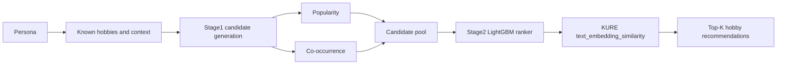

# GNN_Neural_Network: Hobby Recommender

This folder contains the offline `Person -> Hobby` recommender experiments for
`Nemotron-Personas-Korea`.

## Current SOTA

Current SOTA for the **current local data and split** is:

```text
Stage1 = popularity + cooccurrence
Stage2 = LightGBM learned ranker
Stage2 feature = KURE-v1 text_embedding_similarity enabled
LightGBM num_leaves = 31
MMR = false
KURE Stage1 semantic provider = false
```

Selected model:

```text
GNN_Neural_Network/artifacts/experiments/phase5_c_text_embedding/current_locked_kure_stage2_num_leaves31_cpu10/ranker_model.txt
```

The important distinction:

- **Use KURE in Stage2 only** as `text_embedding_similarity`.
- **Do not use KURE as a Stage1 semantic candidate provider**. That path reduced candidate recall.

## Latest Locked Comparison

The latest promotion-grade comparison used the same current data, same split,
same Stage1 candidate pool, and the same LightGBM SOTA recipe (`num_leaves=31`).
Only the Stage2 KURE feature changed.

| Split | Model | Recall@10 | NDCG@10 | Candidate Recall@50 | Decision |
| --- | --- | ---: | ---: | ---: | --- |
| validation | no-text LightGBM | 0.591876 | 0.366105 | 0.827669 | baseline |
| validation | LightGBM + KURE Stage2 | 0.634706 | 0.396559 | 0.827669 | selected |
| test | no-text LightGBM | 0.579626 | 0.360270 | 0.827208 | baseline |
| test | LightGBM + KURE Stage2 | 0.617482 | 0.386258 | 0.827208 | current SOTA |

KURE Stage2 deltas:

| Split | Recall@10 delta | NDCG@10 delta |
| --- | ---: | ---: |
| validation | +0.042830 | +0.030454 |
| test | +0.037856 | +0.025988 |

Conclusion:

```text
KURE-v1 Stage2 feature improves the current SOTA recipe on the current data.
Promote Stage2 KURE text_embedding_similarity for the current offline recommender.
```

Primary artifact:

```text
GNN_Neural_Network/artifacts/experiments/phase5_c_text_embedding/current_locked_num_leaves31_comparison.json
```

## Model Structure



Stage1 creates the candidate pool. Stage2 reranks that fixed pool. KURE is used
only as a Stage2 feature.

## Experiment Decisions

| Experiment family | Role | Result | Current decision |
| --- | --- | --- | --- |
| `popularity + cooccurrence` | Stage1 candidates | strongest stable current candidate pool | keep |
| LightGBM no-text | Stage2 baseline | strong baseline, lower than KURE Stage2 | replaced on current split |
| KURE text feature | Stage2 auxiliary feature | improves Recall/NDCG with same candidate recall | promote for current split |
| KURE semantic Stage1 | Stage1 candidate provider | candidate_recall@50 regressed | rejected |
| KURE dense MMR | diversity reranker | failed accuracy gate | rejected |
| source one-hot features | Stage2 features | regressed | rejected |

## Why Earlier Results Looked Confusing

There are two different comparison contexts:

1. Older closed Phase 2.5 artifacts.
2. Current local 50K data/split artifacts.

The older closed Phase 2.5 feature cache has `9,841` validation persons, while
the current validation split has `10,857` persons. Because the split/cache
provenance differs, those old absolute metrics should not be mixed with the
current locked comparison.

The current decision is based on the current data only:

```text
same current split
same current candidate pool
same LightGBM recipe
no-text vs KURE Stage2 feature
```

Under that controlled comparison, KURE Stage2 wins.

## Current Data Reality

Current local files:

```text
GNN_Neural_Network/data/person_hobby_edges.csv
GNN_Neural_Network/data/person_context.csv
```

Observed current local shape:

| Item | Value |
| --- | ---: |
| edge rows | 50,000 |
| context rows | 50,000 |
| persons with hobby edges | 17,907 |
| unique raw hobby strings | 49,558 |
| average hobbies per person | 2.79 |
| median hobbies per person | 3 |

Raw hobby phrases are not stable item IDs. Promotion-grade experiments must use
the canonical/fallback item pipeline and locked split artifacts.

## Main Artifacts

| Purpose | Path |
| --- | --- |
| Current SOTA comparison | `artifacts/experiments/phase5_c_text_embedding/current_locked_num_leaves31_comparison.json` |
| Current SOTA model | `artifacts/experiments/phase5_c_text_embedding/current_locked_kure_stage2_num_leaves31_cpu10/ranker_model.txt` |
| Current no-text baseline model | `artifacts/experiments/phase5_c_text_embedding/current_locked_no_text_num_leaves31_cpu10/ranker_model.txt` |
| Experiment decisions | `artifacts/experiment_decisions.json` |
| Human-readable run summary | `artifacts/experiment_run_summary.md` |

## Run Commands

Run from the repository root with `.venv` Python.

Install:

```powershell
.\.venv\Scripts\python.exe -m pip install -r GNN_Neural_Network\requirements-gnn.txt
```

Train current SOTA KURE Stage2 ranker:

```powershell
.\.venv\Scripts\python.exe GNN_Neural_Network\scripts\train_ranker.py `
  --config GNN_Neural_Network\configs\kure_text_optin_ranker.yaml `
  --output-dir GNN_Neural_Network\artifacts\experiments\phase5_c_text_embedding\current_locked_kure_stage2_num_leaves31_cpu10 `
  --experiment-id current_locked_kure_stage2_num_leaves31_cpu10 `
  --include-text-embedding-feature `
  --num-leaves 31 `
  --cpu-thread-count 10 `
  --text-embedding-batch-size 32 `
  --progress-mode on
```

Evaluate from cached feature matrix:

```powershell
.\.venv\Scripts\python.exe GNN_Neural_Network\scripts\evaluate_cached_ranker_matrix.py `
  --config GNN_Neural_Network\configs\kure_text_optin_ranker.yaml `
  --split test `
  --model-path GNN_Neural_Network\artifacts\experiments\phase5_c_text_embedding\current_locked_kure_stage2_num_leaves31_cpu10\ranker_model.txt `
  --feature-cache GNN_Neural_Network\artifacts\experiments\phase5_c_text_embedding\kure_text_feature_005_domain_tagged_full_validation\feature_cache\cache\features_14e3fdd1c821675f.npz `
  --output GNN_Neural_Network\artifacts\experiments\phase5_c_text_embedding\current_locked_kure_stage2_num_leaves31_cpu10\test_cached_metrics.json `
  --experiment-id current_locked_kure_stage2_num_leaves31_cpu10 `
  --cpu-thread-count 10 `
  --progress-mode on
```

## Documentation

- `PRD.md` - current requirements, model decision, and promotion rules
- `TASKS.md` - executable task status
- `DATASET_EXPLAIN.md` - dataset shape and leakage notes
- `artifacts/experiment_decisions.json` - machine-readable decisions
- `artifacts/experiment_run_summary.md` - human-readable experiment history
